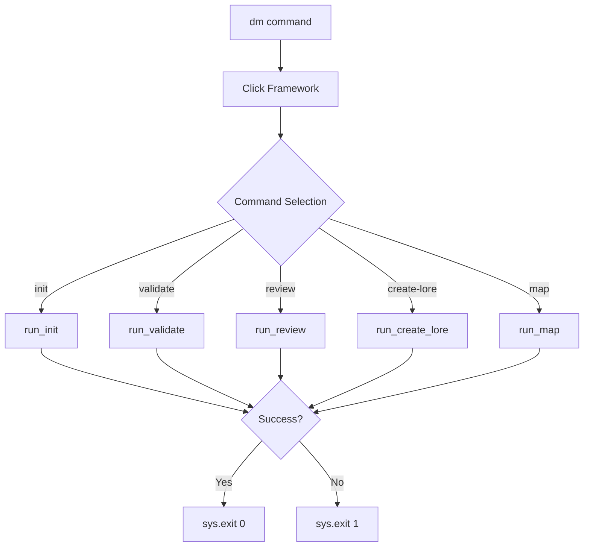

# Documentation for main-interface

## Overview

The main CLI interface serves as the entry point for all Dungeon Master commands, built on the Click framework with proper exit code handling for git hook integration. This module defines the command structure, version management, and ensures all commands properly communicate success/failure status to the shell.

## Dependencies

**Core Python Libraries:**

- `sys` - System exit codes for proper command-line behavior

**External Libraries:**

- `click` - Command-line interface framework with decorators and groups

**Internal Dependencies:**

- All command modules from `dungeon_master.commands`

## Key Functions/Components

### Main Entry Points

- `main()` - Click command group containing all Dungeon Master commands
- `cli()` - Package entry point for installed CLI
- Proper exit code handling for each command

### Command Registration

- `init` - Initialize Dungeon Master in repository
- `validate` - Pre-commit validation (critical for git hooks)
- `review` - Documentation status review with override options
- `create-lore` - Documentation template creation
- `map` - Repository structure visualization

## Usage Examples

```bash
# Show help
dm --help

# Show version
dm --version

# Run any command
dm init
dm validate
dm review
dm create-lore
dm map
```

## Diagrams

### CLI Entry Flow



## Notes

**Exit Code Strategy:**

- Essential for git pre-commit hook integration
- 0 = Success (allows git commit)
- 1 = Failure (blocks git commit)

**Framework Benefits:**

- Click provides automatic help generation
- Command grouping and organization
- Option parsing and validation

**Recent Improvements:**

- **Fixed Version Detection**: Added proper version detection using `importlib.metadata` with fallback for development environments
- **Robust Package Detection**: Version command now works correctly for both pip-installed and development setups

---

_This documentation is linked to dungeon_master/cli.py_
