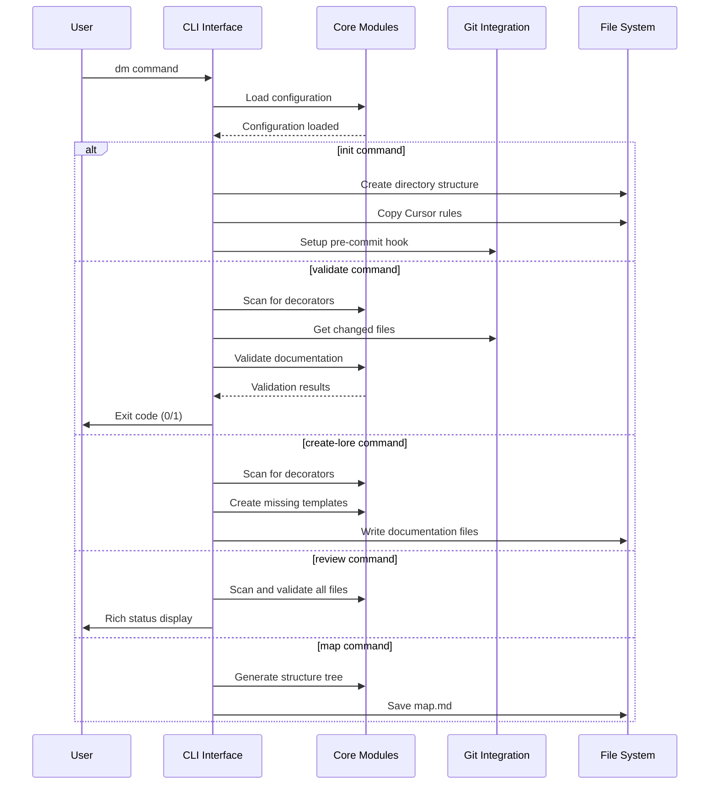
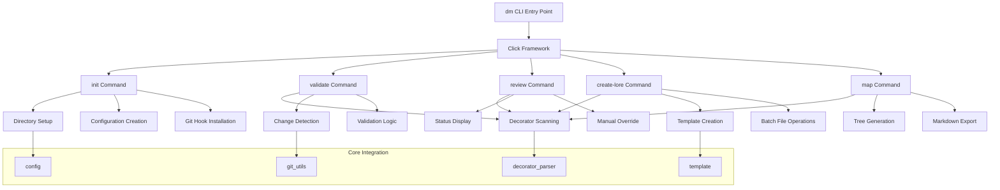
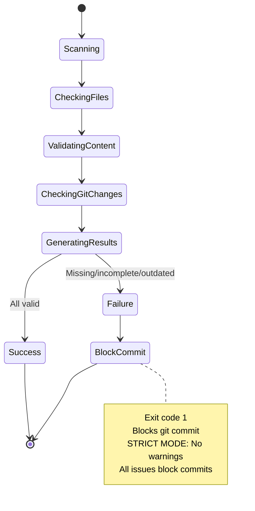

# Documentation for cli-system

## Overview

The CLI system provides the complete command-line interface for Dungeon Master, implementing all user-facing commands for documentation management and validation. This system includes commands for initialization, validation, review, documentation creation, and repository mapping.

The CLI commands are built using Click framework with rich console output, providing a professional and user-friendly interface for all Dungeon Master operations.

## Dependencies

**Core Python Libraries:**

- `sys` - System exit codes for proper command-line behavior
- `pathlib` - Modern file path handling

**External Libraries:**

- `click` - Command-line interface framework
- `rich.console` - Beautiful console output
- `rich.table` - Formatted table display
- `rich.tree` - Tree structure visualization
- `rich.panel` - Panel components for UI

**Internal Dependencies:**

- `dungeon_master.core.decorator_parser` - Source code scanning
- `dungeon_master.core.template` - Documentation template management
- `dungeon_master.core.git_utils` - Git integration
- `dungeon_master.utils.config` - Configuration management

## Key Functions/Components

### Main CLI Entry Point (`cli.py`)

- `main()` - Click group for all Dungeon Master commands
- Proper exit code handling for git hook integration
- Version information and help system

### Core Commands

#### Initialize Command (`init.py`)

- `run_init()` - Sets up Dungeon Master in a repository
- `cleanup_lore_cache_files()` - Removes any cache files from .lore directory to ensure single cache file in project root
- `create_config_files()` - Creates dmconfig.json and dmcache.json with enhanced cache file placement
- `update_gitignore()` - Uses comprehensive template with virtual environment patterns
- Creates `.lore` directory structure
- Installs Cursor rules and configuration files
- Sets up git pre-commit hook

**Recent Improvements:**

- **Cache File Management**: Ensures only one cache file exists in project root, never in .lore directory to prevent AI context token consumption
- **Enhanced Gitignore**: Uses comprehensive template including virtual environments, Python cache files, and Dungeon Master patterns
- **Automatic Cleanup**: Removes any existing cache files from .lore directory during initialization

#### Validation Command (`validate.py`)

- `run_validate()` - Core pre-commit hook functionality with strict enforcement
- Validates documentation completeness and currency
- Checks for template-only files
- **STRICT MODE**: Blocks commits when documentation needs updates (changed code requires updated docs)
- Detects files needing updates based on git changes
- Returns proper exit codes for git hook integration

#### Review Command (`review.py`)

- `run_review()` - Displays comprehensive documentation status
- Rich table showing all tracked files and their documentation status
- Manual review override functionality with safety warnings
- Actionable guidance for fixing documentation issues

#### Create Lore Command (`create_lore.py`)

- `run_create_lore()` - Creates missing documentation files
- Scans for track_lore decorators throughout codebase
- Creates templates with proper directory structure
- Batch file creation with progress reporting

#### Map Command (`map.py`)

- `run_map()` - Generates repository structure visualization
- Creates Rich tree display of project structure
- Shows relationships between source files and documentation
- Saves comprehensive map.md file

## Usage Examples

### Basic Command Usage

```bash
# Initialize Dungeon Master
dm init

# Create missing documentation
dm create-lore

# Review documentation status
dm review

# Validate for commit
dm validate

# Generate repository map
dm map
```

### Advanced Usage

```bash
# Create specific lore file
dm create-lore api/payments.md

# Review with manual override (use with caution)
dm review --mark-reviewed src/utils.py

# Get help for any command
dm validate --help
```

### Integration Examples

```bash
# Pre-commit hook usage
git commit -m "Update payments API"
# Automatically runs: dm validate

# Development workflow
dm create-lore          # Create templates
# Edit documentation files
dm review              # Check status
dm validate            # Verify before commit
```

## Diagrams

### CLI Command Flow



### Command Architecture



### Status Flow Architecture



## Notes

**Command Design Principles:**

- All commands provide rich, colorful output for better user experience
- Proper exit codes ensure git hook integration works correctly
- Comprehensive error handling with actionable error messages
- Consistent interface patterns across all commands

**Exit Code Strategy:**

- 0: Success (allows git commit to proceed)
- 1: Failure (blocks git commit)
- **STRICT ENFORCEMENT**: All documentation issues block commits
- No warning-only mode - missing, incomplete, or outdated documentation prevents commits
- Proper exit codes essential for pre-commit hook functionality

**User Experience Features:**

- Progress indicators for long operations
- Color-coded status indicators (🟢🟡🔴)
- Rich tables and trees for status display
- Clear actionable guidance for fixing issues

**Integration Points:**

- Git pre-commit hook integration
- Cursor IDE rules integration
- Configuration system integration
- Template system integration

**Error Handling:**

- Graceful degradation when git is not available
- Clear error messages for configuration issues
- Safe handling of file system operations
- Comprehensive validation of user inputs

**Performance Considerations:**

- Efficient repository scanning with exclusions
- Minimal git command invocations
- Cached configuration loading
- Parallel file operations where possible

---

_This documentation is linked to dungeon_master/commands/review.py, dungeon_master/commands/map.py, dungeon_master/commands/validate.py, dungeon_master/commands/create_lore.py, dungeon_master/commands/init.py_
