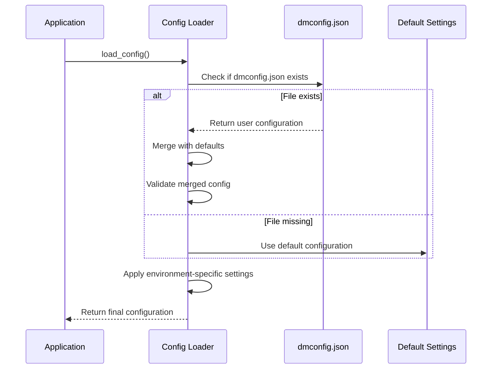
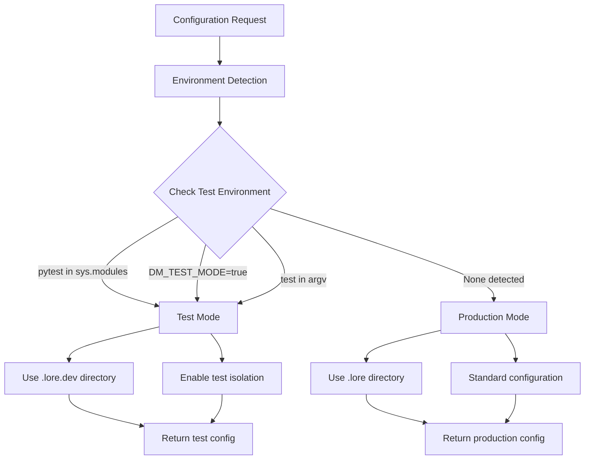
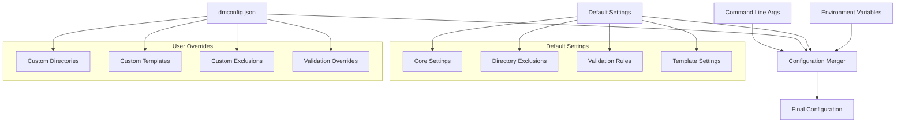

# Documentation for configuration

## Overview

The configuration system provides comprehensive management of Dungeon Master settings through `dmconfig.json` files with intelligent defaults, validation, and environment-aware behavior. This system handles all aspects of Dungeon Master configuration including directory exclusions, template settings, validation rules, and environment isolation for testing.

The configuration module enables users to customize Dungeon Master behavior while maintaining sensible defaults that work out of the box for most projects.

## Dependencies

**Core Python Libraries:**

- `json` - Configuration file parsing and serialization
- `os` - Environment variable access
- `sys` - System-specific parameters and functions
- `pathlib` - Modern file path handling

**External Libraries:**

- `rich.console` - Formatted console output for configuration messages

**Internal Dependencies:**

- `dungeon_master.core.template` - Template system integration

## Key Functions/Components

### Configuration Management

- `load_config()` - Loads configuration from dmconfig.json with defaults
- `save_config()` - Saves configuration to dmconfig.json with validation
- `create_default_config()` - Creates initial configuration file
- `validate_config()` - Validates configuration values and types

### Settings Management

- `get_setting()` - Retrieves specific configuration values
- `update_setting()` - Updates and saves individual configuration settings
- `merge_config_with_args()` - Merges configuration with command-line arguments

### Environment Detection

- `is_test_environment()` - Detects test execution environment
- `get_lore_directory()` - Returns appropriate lore directory for environment
- `ensure_lore_directory_isolation()` - Sets up test environment isolation

### Template Integration

- `get_template_content()` - Retrieves template content (default or custom)

## Usage Examples

### Loading Configuration

```python
from dungeon_master.utils.config import load_config

# Load with defaults
config = load_config()

# Load with verbose output
config = load_config(verbose=True)

# Load custom config file
config = load_config("custom_config.json")
```

### Managing Settings

```python
from dungeon_master.utils.config import get_setting, update_setting

# Get specific setting
lore_dir = get_setting("loreDirectory", config)

# Update setting
success = update_setting("requireDiagrams", False, verbose=True)
```

### Environment Detection

```python
from dungeon_master.utils.config import is_test_environment, get_lore_directory

# Check environment
if is_test_environment():
    print("Running in test mode")

# Get appropriate lore directory
lore_dir = get_lore_directory()  # ".lore" or ".lore.dev"
```

### Configuration Validation

```python
from dungeon_master.utils.config import validate_config

config = {
    "loreDirectory": ".lore",
    "enforceDocumentation": True,
    "requiredSections": ["Overview", "Functions/Components"]
}

errors = validate_config(config)
if errors:
    print("Configuration errors:", errors)
```

## Diagrams

### Configuration Loading Flow



### Environment Detection Architecture



### Configuration Hierarchy



## Notes

**Configuration Precedence:**

1. Command-line arguments (highest priority)
2. dmconfig.json user settings
3. Environment variables
4. Default configuration (lowest priority)

**Environment Isolation:**

- Test environment automatically uses `.lore.dev` directory
- Prevents test artifacts from contaminating production documentation
- Test directory automatically added to `.gitignore`

**Validation Features:**

- Type checking for all configuration values
- Range validation for numeric settings
- Path validation for custom templates
- Comprehensive error reporting

**Extensibility:**

- Configuration schema can be extended with new settings
- Custom validation rules can be added
- Environment detection can be expanded for new contexts

**Performance:**

- Configuration is cached after first load
- File operations are minimized
- Validation is performed only when settings change

---

_This documentation is linked to dungeon_master/utils/config.py_
