# Documentation for engine

## Overview

<!-- REQUIRED: Provide a brief overview of what this file does and its purpose -->

The core engine of Dungeon Master provides the fundamental functionality for parsing source code decorators, managing documentation templates, integrating with git workflows, and validating documentation completeness. These four modules work together to create a comprehensive documentation enforcement system.

This engine enables automatic discovery of `track_lore` decorators in source code, generation of documentation templates, detection of file changes through git integration, and validation that ensures documentation stays current with code changes.

## Dependencies

<!-- List any important dependencies or related components -->

**Core Python Libraries:**

- `pathlib` - Modern file path handling
- `subprocess` - Git command execution
- `json` - Configuration file parsing
- `re` - Regular expression pattern matching for decorators

**External Libraries:**

- `rich` - Beautiful console output and formatting
- `click` - Command-line interface framework

**Internal Dependencies:**

- `dungeon_master.utils.config` - Configuration management
- `dungeon_master.utils.file_utils` - File operation utilities

## Key Functions/Components

<!-- REQUIRED: Document the main functions, classes, or features -->

### Decorator Parser (`decorator_parser.py`)

- `scan_repository_for_lore_decorators()` - Recursively scans repository for track_lore decorators
- `extract_lore_paths()` - Extracts lore file paths from individual source files
- `is_supported_file()` - Determines if file type supports decorators (Python, TypeScript)
- `should_skip_directory()` - Implements directory exclusion logic for performance

### Template System (`template.py`)

- `create_lore_file()` - Creates individual documentation files with templates
- `create_multiple_lore_files()` - Batch creates multiple lore files
- `validate_lore_file()` - Validates completeness of documentation files
- `populate_template()` - Fills template placeholders with actual content
- `is_template_file()` - Detects if file still contains template placeholders

### Git Integration (`git_utils.py`)

- `get_changed_files()` - Retrieves list of modified files from git
- `is_git_repository()` - Checks if current directory is a git repository
- `get_tracked_files()` - Lists all git-tracked files
- `has_uncommitted_changes()` - Detects uncommitted changes

### Validation System (`validation.py`)

- _Note: This module exists but is not yet implemented - reserved for future validation logic_

## Usage Examples

<!-- Provide examples of how to use this code -->

### Scanning for Decorators

```python
from dungeon_master.core.decorator_parser import scan_repository_for_lore_decorators
from dungeon_master.utils.config import load_config

config = load_config()
mapping = scan_repository_for_lore_decorators(config=config)
# Returns: {"api/docs.md": ["src/api.py", "src/handlers.py"]}
```

### Creating Documentation Templates

```python
from dungeon_master.core.template import create_multiple_lore_files

lore_mapping = {
    "api/payments.md": ["src/payments.py"],
    "core/auth.md": ["src/auth/login.py", "src/auth/middleware.py"]
}

results = create_multiple_lore_files(lore_mapping, lore_root=".lore")
# Creates template files with proper directory structure
```

### Git Change Detection

```python
from dungeon_master.core.git_utils import get_changed_files

changed = get_changed_files(include_staged=True, include_unstaged=True)
# Returns: ["src/api.py", "src/models.py"]
```

### Template Validation

```python
from dungeon_master.core.template import validate_lore_file
from pathlib import Path

validation = validate_lore_file(Path(".lore/api/docs.md"))
# Returns: {"is_template": False, "is_valid": True, "missing_sections": []}
```

## Diagrams

<!-- REQUIRED: Include professional-quality diagrams that illustrate the component's structure, behavior, or relationships -->
<!-- Use mermaid.js syntax for diagrams: https://mermaid-js.github.io/ -->
<!-- Include at least one diagram that best represents this component -->

### Core Engine Workflow

```mermaid
sequenceDiagram
    participant CLI as CLI Command
    participant Parser as Decorator Parser
    participant Template as Template System
    participant Git as Git Integration
    participant Validator as Validation Engine

    CLI->>Parser: scan_repository_for_lore_decorators()
    Parser->>Parser: Recursively scan source files
    Parser->>Parser: Extract track_lore decorators
    Parser-->>CLI: Return {lore_file: [source_files]}

    CLI->>Template: create_multiple_lore_files()
    Template->>Template: Generate templates for missing files
    Template-->>CLI: Return creation results

    CLI->>Git: get_changed_files()
    Git->>Git: Execute git diff commands
    Git-->>CLI: Return list of changed files

    CLI->>Validator: validate_lore_file() for each
    Validator->>Validator: Check template completeness
    Validator-->>CLI: Return validation status
```



### Component Architecture


### Data Flow Architecture


## Notes

<!-- Any additional information that might be important -->

**Performance Considerations:**

- The decorator parser uses a custom recursive directory walker instead of glob patterns to avoid scanning excluded directories like `.venv`
- File scanning is optimized to skip binary files and unsupported file types early
- Git integration caches results where possible to avoid repeated subprocess calls

**Error Handling:**

- All modules include comprehensive error handling for file system operations
- Git integration gracefully handles non-git repositories
- Template system validates input paths and handles encoding issues

**Environment Isolation:**

- The engine respects test vs production environment separation
- Test environment uses `.lore.dev` directory to avoid conflicts
- Configuration-based exclusions prevent scanning of example/test files in production

**Extensibility:**

- The decorator parser can be extended to support additional file types
- Template system supports custom templates via configuration
- Validation engine is designed for future expansion with additional validation rules

---

_This documentation is linked to dungeon_master/core/decorator_parser.py, dungeon_master/core/template.py, dungeon_master/core/git_utils.py, dungeon_master/core/validation.py_
