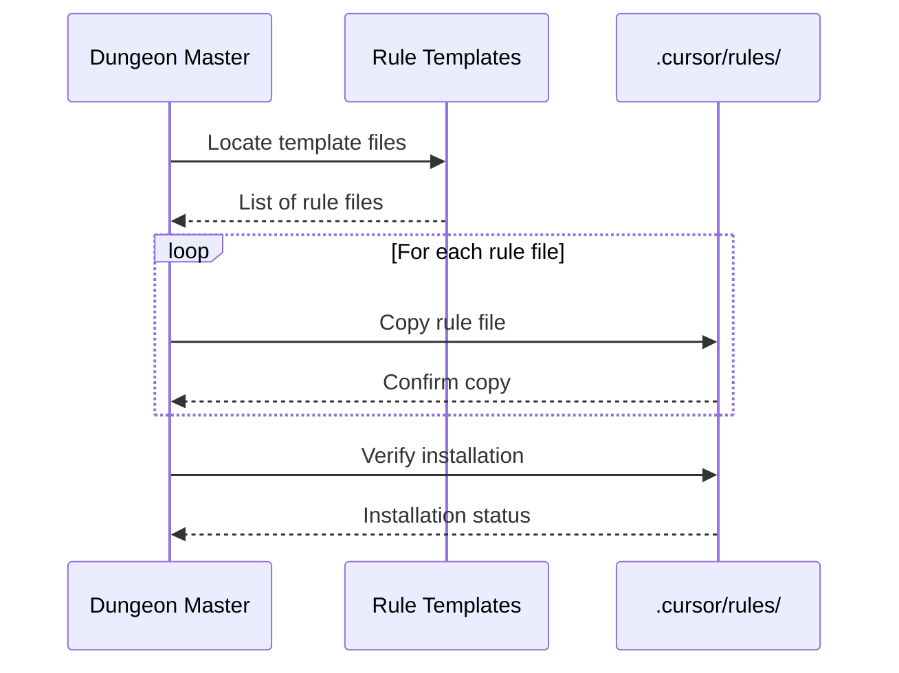

# Documentation for cursor

## Overview

The Cursor integration module manages the setup and maintenance of Cursor IDE rules for Dungeon Master. This module handles copying rule templates, verifying installations, and maintaining Cursor IDE configuration to ensure consistent development practices across the team.

## Dependencies

**Core Python Libraries:**

- `pathlib` - Modern file path handling
- `shutil` - File operations for copying templates

**External Libraries:**

- `rich.console` - Console output formatting

**Internal Dependencies:**

- Rule templates from `templates/cursor_rules/` directory

## Key Functions/Components

### Rule Management

- `setup_cursor_rules()` - Copies all rule templates to `.cursor/rules/`
- `verify_cursor_rules_setup()` - Checks if rules are properly installed
- `remove_cursor_rules()` - Removes installed Cursor rules

### Template Operations

- `get_templates_directory()` - Locates the templates directory
- `copy_rule_file()` - Copies individual rule files with validation

## Usage Examples

```python
from dungeon_master.utils.cursor_setup import setup_cursor_rules

# Setup all Cursor rules
copied, failed = setup_cursor_rules()
print(f"Copied {len(copied)} rules, {len(failed)} failed")
```

## Diagrams

### Cursor Rules Setup Flow



## Notes

**Rule Files:**

- `dungeon_master_commands.mdc` - Command documentation
- `dungeon_master_enforcement.mdc` - Enforcement rules
- `dungeon_master_template.mdc` - Template guidelines
- `dungeon_master_workflow.mdc` - Workflow patterns

**Installation Process:**

- Creates `.cursor/rules/` directory if needed
- Copies all template files with verification
- Reports success/failure for each file

---

_This documentation is linked to dungeon_master/utils/cursor_setup.py_
