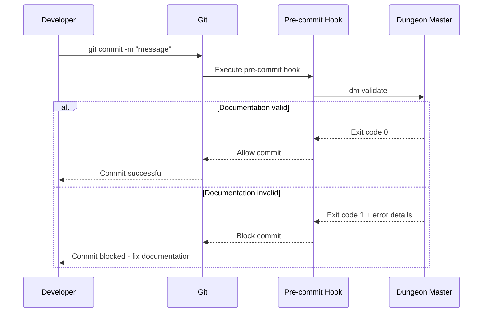

# Documentation for git-hooks

## Overview

The git hooks integration module manages the pre-commit hook functionality that enforces documentation requirements. This module ensures that all tracked code changes are accompanied by corresponding documentation updates, blocking commits when documentation is missing or outdated.

## Dependencies

**Core Python Libraries:**

- `subprocess` - Git command execution
- `sys` - Exit code management

**External Libraries:**

- `rich.console` - Console output formatting

**Internal Dependencies:**

- `dungeon_master.commands.validate` - Core validation logic
- `dungeon_master.core.git_utils` - Git integration utilities

## Key Functions/Components

### Pre-commit Hook Logic

- Integration with git pre-commit workflow
- Automatic validation on every commit attempt
- Proper exit code handling to block/allow commits

### Validation Integration

- Calls the main validation system
- Processes validation results
- Formats output for git hook context

## Usage Examples

```bash
# Pre-commit hook is automatically triggered
git commit -m "Update API"
# Runs: dm validate

# Manual validation
dm validate
```

## Diagrams

### Pre-commit Hook Flow



## Notes

**Critical Functionality:**

- Blocks commits when documentation is missing or incomplete
- Ensures documentation stays current with code changes
- Provides clear guidance on what needs to be fixed

**Installation:**

- Automatically installed by `dm init`
- Creates executable hook in `.git/hooks/pre-commit`
- Calls `dm validate` on every commit attempt

---

_This documentation is linked to dungeon_master/hooks/pre_commit.py_
