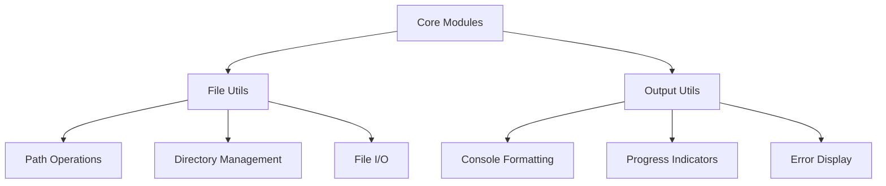

# Documentation for utilities

## Overview

The utilities modules provide essential supporting functionality for Dungeon Master, including file operations and output formatting. These modules handle low-level operations that are used throughout the system for file manipulation and user interface output.

## Dependencies

**Core Python Libraries:**

- `pathlib` - Modern file path handling
- `os` - Operating system interface
- `shutil` - File operations

**External Libraries:**

- `rich` - Console output formatting and styling

## Key Functions/Components

### File Utilities (`file_utils.py`)

- File system operations and path handling
- Directory creation and validation
- File content manipulation
- Path resolution and normalization

### Output Utilities (`output.py`)

- Console output formatting
- Progress indicators and status messages
- Error message formatting
- Consistent styling across the application

## Usage Examples

```python
# File operations
from dungeon_master.utils.file_utils import ensure_directory

ensure_directory(".lore/api")

# Output formatting
from dungeon_master.utils.output import format_success

format_success("Operation completed successfully")
```

## Diagrams

### Utilities Architecture



## Notes

**Design Principles:**

- Centralized utility functions to avoid duplication
- Consistent error handling across all file operations
- Rich console output for better user experience

---

_This documentation is linked to dungeon_master/utils/file_utils.py, dungeon_master/utils/output.py_
