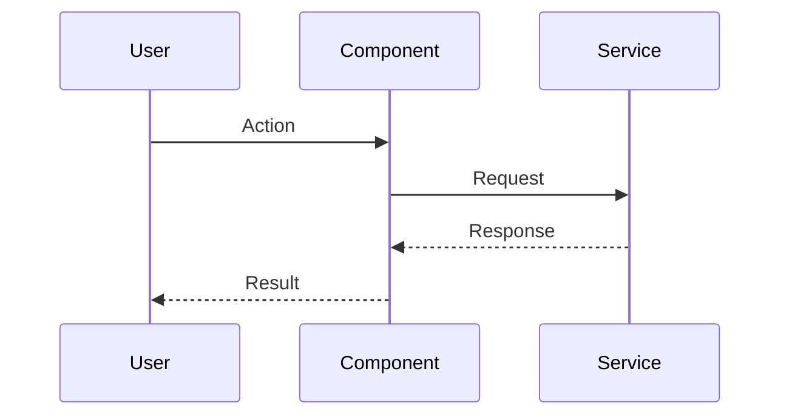
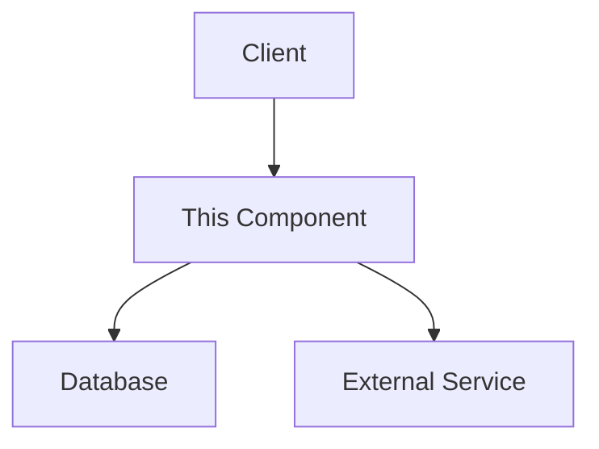

# Dungeon Master PRD

## Product Overview

Dungeon Master is a lightweight pre-commit hook system designed to enforce documentation updates alongside code changes. The primary purpose is to maintain synchronization between code and documentation by blocking commits when documentation isn't updated for modified files.

### Target Users

- Software developers working with Cursor IDE
- Development teams prioritizing documentation quality
- Open source projects requiring documentation discipline

### Key Value Propositions

- Ensures documentation remains current with codebase changes
- Provides clear visibility into documentation requirements
- Seamlessly integrates into existing development workflows
- Works with Cursor to automatically identify documentation needs

## Core Functionality

### Lore Decorator System

Files must include decorator lines that associate them with specific documentation:

```
# track_lore("payments.md")
# track_lore("payments-platform/payouts.md")
```

For TypeScript files:

```typescript
// track_lore("payments.md")
// track_lore("payments-platform/agents.md")
```

- Multiple decorators allowed per file
- Decorator format follows `track_lore("path/to/doc.md")` pattern (without `.lore/` prefix)
- All documentation files are automatically created in the `.lore/` directory
- Supports nested directory structures within `.lore/` (e.g., `payments-platform/payouts.md` becomes `.lore/payments-platform/payouts.md`)
- Subdirectories are automatically created as needed

### Lore File Templates

When new lore files are created, they are populated with a template that:

- Provides guidance on what documentation should cover
- Contains placeholders for relevant sections
- Includes clear indicators for sections that must be filled out
- Helps Cursor agents understand what documentation is needed

The default template structure:

````markdown
# Documentation for {filename}

## Overview

<!-- REQUIRED: Provide a brief overview of what this file does and its purpose -->

[PLEASE FILL OUT: Overview]

## Dependencies

<!-- List any important dependencies or related components -->

[PLEASE FILL OUT: Dependencies]

## Key Functions/Components

<!-- REQUIRED: Document the main functions, classes, or features -->

[PLEASE FILL OUT: Functions/Components]

## Usage Examples

<!-- Provide examples of how to use this code -->

[PLEASE FILL OUT: Examples]

## Diagrams

<!-- REQUIRED: Include professional-quality diagrams that illustrate the component's structure, behavior, or relationships -->
<!-- Use mermaid.js syntax for diagrams: https://mermaid-js.github.io/ -->
<!-- Include at least one diagram that best represents this component -->

### Sequence Diagram



### Component/Architecture Diagram



### Additional Diagrams

<!-- Add any other diagrams that help explain this component -->
<!-- Class diagrams, state diagrams, etc. as appropriate -->

## Notes

<!-- Any additional information that might be important -->

---

_This documentation is linked to {tracked_files}_
````

- Template fields (like `{filename}` and `{tracked_files}`) are automatically populated
- Sections marked "REQUIRED" must be filled out before validation passes
- Diagrams are expected to be professional and detailed, not high-level or superficial
- The template is designed to be Cursor-friendly, with clear indicators for necessary information

### Change Detection & Enforcement

- All code changes will be tracked regardless of size
- Pre-commit hooks will block commits when documentation isn't updated
- Cursor will determine if changes warrant documentation updates
- CLI will provide manual override for trivial changes via "review" functionality
- Enhanced validation ensures lore files aren't just template files but contain actual documentation
- Template detection logic examines whether required sections still contain placeholder text

### Manual Review Override

For minor code changes that don't impact documentation:

- The `dm review --mark-reviewed <file>` command allows marking specific files as reviewed
- This bypasses the pre-commit block for that specific file
- **IMPORTANT**: This override should ONLY be used after careful evaluation of the changes
- Before using this override:
  1. THOROUGHLY REVIEW the changed file to understand all modifications
  2. ASSESS whether the corresponding documentation needs updates
  3. CONFIRM the changes are truly minor and don't affect documented behavior
- If the documentation does need updates, DO NOT use the override
- This applies to both files needing updates and template-only files

### Project Structure

The system will establish:

- `.lore/` directory for documentation files
- `dmconfig.json` for configuration
- `dmcache.json` for tracking state (gitignored)
- `.cursor/rules/` directory for Cursor IDE integration rules

### Cursor Rules Integration

The system includes four pre-created Cursor rule files that should be copied during initialization:

1. **`dungeon_master_workflow.mdc`** - Documents the documentation-driven development workflow

   - Located in templates directory
   - Describes the process of creating, updating, and maintaining documentation
   - Includes step-by-step guides for common scenarios

2. **`dungeon_master_enforcement.mdc`** - Details the core enforcement principles

   - Located in templates directory
   - Explains how the pre-commit hook blocks commits when documentation is missing or outdated
   - Provides guidance on what to track and how validation works

3. **`dungeon_master_commands.mdc`** - Comprehensive reference for all CLI commands

   - Located in templates directory
   - Includes usage examples, options, and sample outputs
   - Provides guidance on command combinations for common workflows

4. **`dungeon_master_template.mdc`** - Documents the documentation template structure
   - Located in templates directory
   - Outlines the standard documentation template and requirements
   - Provides best practices for documentation

These rule files are already created and should be copied from the templates directory to the `.cursor/rules/` directory during initialization. The initialization command should create the `.cursor/rules/` directory if it doesn't exist.

## CLI Commands

### `dm init`

Initializes the Dungeon Master environment:

- Creates `.lore/` directory if it doesn't exist
- Creates `.cursor/rules/` directory if it doesn't exist
- Copies the four pre-created rule files from templates directory to `.cursor/rules/`
- Creates empty `dmconfig.json` and `dmcache.json` files
- Updates `.gitignore` to exclude `dmcache.json`

**Example Output:**

```
✨ [bold green]Initializing Dungeon Master[/bold green] ✨

📁 Creating directory structure...
  ✅ Created [cyan].lore/[/cyan] directory
  ✅ Created [cyan].cursor/rules/[/cyan] directory

📝 Creating configuration files...
  ✅ Created [cyan]dmconfig.json[/cyan]
  ✅ Created [cyan]dmcache.json[/cyan]

🔮 Setting up gitignore...
  ✅ Updated [cyan].gitignore[/cyan] to exclude [cyan]dmcache.json[/cyan]

🧙 Setting up Cursor rules...
  ✅ Copied [cyan]dungeon_master_workflow.mdc[/cyan] to [cyan].cursor/rules/[/cyan]
  ✅ Copied [cyan]dungeon_master_enforcement.mdc[/cyan] to [cyan].cursor/rules/[/cyan]
  ✅ Copied [cyan]dungeon_master_commands.mdc[/cyan] to [cyan].cursor/rules/[/cyan]
  ✅ Copied [cyan]dungeon_master_template.mdc[/cyan] to [cyan].cursor/rules/[/cyan]

[bold green]Initialization complete! Your project is now protected by Dungeon Master.[/bold green]
```

### `dm map`

Generates a visual representation of repository structure:

- Creates a file tree map of all tracked files
- Shows relationships between source files and documentation
- Saves output as `map.md` in `.lore/` directory

**Example Output:**

```
📊 [bold green]Generating Repository Map[/bold green] 📊

🔍 Scanning repository structure...

📂 [bold]Project Tree:[/bold]
├── 📁 src/
│  ├── 📄 api/
│  │  ├── 📄 payment.py [italic yellow](tracked by .lore/payments.md)[/italic yellow]
│  │  ├── 📄 payment_processor.py [italic yellow](tracked by .lore/payments.md)[/italic yellow]
│  │  └── 📄 payouts.py [italic yellow](tracked by .lore/payments-platform/payouts.md)[/italic yellow]
│  ├── 📄 models/
│  │  └── 📄 user.py [italic yellow](tracked by .lore/users.md)[/italic yellow]
│  ├── 📄 auth/
│  │  └── 📄 login.py [italic yellow](tracked by .lore/auth/login.md)[/italic yellow]
│  └── 📄 main.py [italic yellow](tracked by .lore/app.md)[/italic yellow]
├── 📁 tests/
│  └── 📄 test_payment.py
└── 📁 .lore/
   ├── 📄 payments.md
   ├── 📁 payments-platform/
   │  └── 📄 payouts.md
   ├── 📄 users.md
   ├── 📁 auth/
   │  └── 📄 login.md
   └── 📄 app.md

✅ Map generated and saved to [cyan].lore/map.md[/cyan]
```

### `dm review`

Displays documentation status using rich formatting:

- Shows table with lore file paths
- Lists all files associated with each lore document
- Highlights lore files requiring updates based on changed source files
- Identifies lore files that still contain template placeholders
- Provides clear visualization of documentation needs
- Offers manual override options for minor changes

**Example Output:**

```
🔍 [bold green]Documentation Review[/bold green] 🔍

┏━━━━━━━━━━━━━━━━━━━━━━━━━━━━━━┳━━━━━━━━━━━━━━━━━━━━━━━━━━━━━━━━━━━━━━━━━┳━━━━━━━━━━━━━━━━━━━━━━┓
┃ [bold]Lore File[/bold]                      ┃ [bold]Tracked Files[/bold]                              ┃ [bold]Status[/bold]              ┃
┡━━━━━━━━━━━━━━━━━━━━━━━━━━━━━━╇━━━━━━━━━━━━━━━━━━━━━━━━━━━━━━━━━━━━━━━━━╇━━━━━━━━━━━━━━━━━━━━━━┩
│ .lore/payments.md              │ src/api/payment.py [bold yellow][changed][/bold yellow]               │ [bold red]NEEDS UPDATE[/bold red]         │
│                               │ src/api/payment_processor.py                  │                      │
├───────────────────────────────┼────────────────────────────────────────────────┼──────────────────────────┤
│ .lore/payments-platform/      │ src/api/payouts.py                            │ [bold green]UP TO DATE[/bold green]         │
│ payouts.md                    │                                                │                      │
├───────────────────────────────┼────────────────────────────────────────────────┼──────────────────────────┤
│ .lore/users.md                │ src/models/user.py                             │ [bold green]UP TO DATE[/bold green]         │
├───────────────────────────────┼────────────────────────────────────────────────┼──────────────────────────┤
│ .lore/auth/login.md           │ src/auth/login.py                              │ [bold yellow]TEMPLATE ONLY[/bold yellow]      │
└───────────────────────────────┴────────────────────────────────────────────────┴──────────────────────────┘

❗ [bold yellow]REQUIRED ACTIONS:[/bold yellow]
  → UPDATE [cyan].lore/payments.md[/cyan] TO REFLECT CHANGES IN [cyan]src/api/payment.py[/cyan]
    REVIEW THESE FILES TO UNDERSTAND THE ENTIRE SYSTEM:
    - src/api/payment.py
    - src/api/payment_processor.py

  → COMPLETE [cyan].lore/auth/login.md[/cyan] TEMPLATE WITH ACTUAL DOCUMENTATION
    REVIEW THESE FILES TO UNDERSTAND THE ENTIRE SYSTEM:
    - src/auth/login.py

[dim]Manual override option (use with caution):[/dim]
  [cyan]dm review --mark-reviewed src/api/payment.py[/cyan]  # For minor changes only
  [cyan]dm review --mark-reviewed src/auth/login.py[/cyan]  # For template files
```

### `dm create_lore`

Creates missing documentation files:

- Scans all decorators in codebase
- Creates empty lore files that don't exist yet
- Creates any necessary subdirectories within `.lore/`
- Populates new files with the standard documentation template
- Accepts optional parameter for specific lore file creation

**Example Output:**

```
🔮 [bold green]Creating Lore Files[/bold green] 🔮

🔍 Scanning for track_lore decorators...
  Found 5 unique lore files referenced in code

📝 Checking documentation status...
  ✅ [cyan].lore/payments.md[/cyan] (exists)
  ✅ [cyan].lore/payments-platform/payouts.md[/cyan] (exists)
  ✅ [cyan].lore/users.md[/cyan] (exists)
  ❌ [cyan].lore/config.md[/cyan] (missing)
  ❌ [cyan].lore/auth/login.md[/cyan] (missing)

📁 Creating necessary directories...
  ✅ Created [cyan].lore/auth/[/cyan] directory

📑 Creating missing lore files with templates...
  ✅ Created [cyan].lore/config.md[/cyan] with documentation template
  ✅ Created [cyan].lore/auth/login.md[/cyan] with documentation template

✨ [bold green]Complete![/bold green] All lore files are now created.
⚠️ [bold yellow]WARNING:[/bold yellow] FILL OUT ALL TEMPLATES WITH ACTUAL DOCUMENTATION BEFORE COMMITTING.
```

### `dm validate`

Core pre-commit hook functionality:

- Verifies each tracked file has corresponding lore file
- Checks that changed tracked files have updated lore
- Ensures lore files contain more than just the template content
- Detects placeholder text in required sections
- Validates that professional diagrams are included when required
- Internally runs `dm create_lore` and `dm review`
- Blocks commits when validation fails
- Provides clear error messages for required actions

**Example Output:**

```
🔒 [bold green]Validating Documentation[/bold green] 🔒

🔍 Checking git staged changes...
  Found 4 changed files with track_lore decorators

📝 Checking documentation status...
  ✓ [cyan]src/models/user.py[/cyan] → [cyan].lore/users.md[/cyan] [bold green]UPDATED[/bold green]
  ✓ [cyan]src/api/payouts.py[/cyan] → [cyan].lore/payments-platform/payouts.md[/cyan] [bold green]UPDATED[/bold green]
  ✗ [cyan]src/api/payment.py[/cyan] → [cyan].lore/payments.md[/cyan] [bold red]NOT UPDATED[/bold red]
  ✗ [cyan]src/auth/login.py[/cyan] → [cyan].lore/auth/login.md[/cyan] [bold yellow]TEMPLATE ONLY[/bold yellow]

❌ [bold red]VALIDATION FAILED[/bold red]

[bold yellow]REQUIRED ACTIONS:[/bold yellow]
  1. UPDATE [cyan].lore/payments.md[/cyan] TO REFLECT CHANGES IN [cyan]src/api/payment.py[/cyan]
     REVIEW ALL FILES TRACKED BY THIS LORE FILE:
     - src/api/payment.py
     - src/api/payment_processor.py

  2. COMPLETE [cyan].lore/auth/login.md[/cyan] TEMPLATE WITH ACTUAL DOCUMENTATION
     REVIEW ALL FILES TRACKED BY THIS LORE FILE:
     - src/auth/login.py

     MISSING REQUIRED SECTIONS: Overview, Key Functions/Components, Diagrams

🛑 [bold red]COMMIT BLOCKED: UPDATE DOCUMENTATION BEFORE PROCEEDING[/bold red]
```

## Technical Requirements

### Implementation Language & Libraries

- Python for CLI implementation
- Rich library for formatted console output
- GitPython for git integration
- Click for command line interface

### File Formats

- Documentation files: Markdown (.md)
- Configuration: JSON
- Cache/state tracking: JSON (gitignored)

## Integration Points

### Git Hooks

- Pre-commit hook integration via standard git hooks mechanism
- Hook installation during `dm init`

### Cursor Integration

- No direct AI components within Dungeon Master
- Structured output messages for Cursor to interpret:
  - "UPDATE [file]. UPDATE [documentation file]."
  - "NEW FILE [file] REQUIRES DOCUMENTATION IN [template]. COMPLETE THE TEMPLATE."
- Custom rules for Cursor to recognize documentation requirements
- Template placeholders designed to be easily identified by Cursor
- Cursor must carefully evaluate changes before using manual review override

## Roadmap Considerations

### MVP Features (Phase 1)

- Basic decorator parsing (Python and TypeScript)
- Pre-commit hook implementation
- Core CLI commands
- Cursor rules generation
- Lore file templates with placeholder detection
- Enhanced validation to ensure templates are properly filled
- Support for nested directory structures within `.lore/`
- Professional diagram requirements in documentation
- File grouping for lore files with multiple tracked sources
- Manual review override for minor changes

## Success Metrics

- Reduction in outdated documentation
- Developer adoption rate
- Documentation quality improvement
- Reduction in documentation-related issues

```

```
