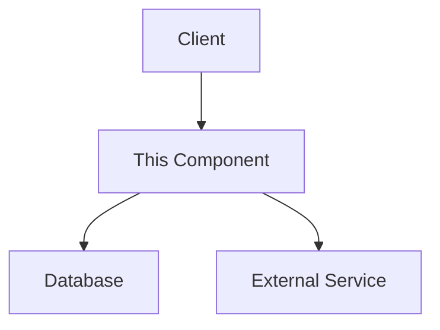
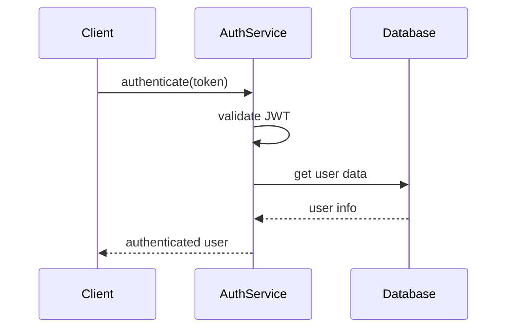

# 🏰 Dungeon Master

**A context-tracking pre-commit tool for Cursor AI integration.**

Blocks commits until meaningful documentation exists. Creates structured templates that Cursor fills with intelligent content. Enforces quality through automated validation.

```bash
pip install cursor-dungeon-master
dm init
```

---

## ⚔️ How It Works

### 1. **Track Important Files**

Add a simple decorator to mark files for documentation:

```python
# track_lore("auth_service.md")
class AuthService:
    def authenticate(self, token: str) -> bool:
        pass
```

### 2. **Commit Triggers Template Creation**

When you commit, Dungeon Master creates a structured template:

```markdown
# auth_service.py - Context Documentation

## Overview

[PLEASE FILL OUT: Overview]

## Key Functions/Components

- **authenticate(token)**: [PLEASE FILL OUT: Purpose and usage]
- **generate_token(user_id)**: [PLEASE FILL OUT: Purpose and usage]

## Dependencies

[PLEASE FILL OUT: Dependencies]
```

### 3. **🛡️ Commit Blocked Until Complete**

```
🔒 VALIDATION FAILED
❗ COMMIT BLOCKED
Fix the above issues before committing.
```

### 4. **🧙‍♂️ Cursor Fills Templates**

Use Cursor to replace placeholders with meaningful content:

```markdown
## Overview

Provides JWT-based authentication with secure password hashing
and session management for user login workflows.

## Key Functions/Components

- **authenticate(token)**: Validates JWT tokens and returns user data
- **generate_token(user_id)**: Creates signed JWT tokens for authenticated users
```

### 5. **✅ Validation Passes, Commit Proceeds**

```
✅ VALIDATION PASSED
All documentation is properly maintained.
```

---

## 🎯 Quick Start

```bash
# Install
pip install cursor-dungeon-master

# Initialize in your repo
dm init

# Mark files for tracking
echo '# track_lore("my_feature.md")' >> src/my_feature.py

# Commit triggers the workflow
git add . && git commit -m "Add new feature"
```

**That's it!** Dungeon Master will guide you through the rest.

---

## 🗡️ Commands

| Command          | Purpose                                      |
| ---------------- | -------------------------------------------- |
| `dm init`        | 🏰 Initialize Dungeon Master in repository   |
| `dm create-lore` | 📜 Create/update templates for tracked files |
| `dm review`      | 🗺️ Show all tracked files and status         |
| `dm validate`    | 🛡️ Check what would block commits            |
| `dm map`         | 🔮 Generate repository structure map         |

---

## 📜 Template Example

**Generated Template:**

````markdown
# Documentation for auth_service

## Overview

[PLEASE FILL OUT: Overview]

## Dependencies

[PLEASE FILL OUT: Dependencies]

## Key Functions/Components

[PLEASE FILL OUT: Functions/Components]

## Usage Examples

[PLEASE FILL OUT: Examples]

## Diagrams

### Component Architecture


````

````

**After Cursor Completion:**

```markdown
# Documentation for auth_service

## Overview

Comprehensive authentication service handling user login, JWT token
management, and secure session tracking. Core security component
for all user authentication workflows.

## Dependencies

**Core Python Libraries:**
- `jwt` - Provides JWT encoding/decoding for stateless authentication
- `hashlib` - SHA-256 password hashing for secure credential storage

## Key Functions/Components

### Authentication Methods
- `authenticate(token)` - Validates JWT tokens, returns user data or raises AuthError
- `generate_token(user_id)` - Creates signed JWT with user claims and expiration

## Usage Examples

```python
from auth_service import AuthService

auth = AuthService()
token = auth.generate_token(user_id=123)
user_data = auth.authenticate(token)
````

## Diagrams

### Authentication Flow



```

---

## 🏺 Project Structure

```

your_project/
├── 📜 .lore/ # Generated documentation
│ ├── auth_service.md # ✅ Complete
│ ├── api_client.md # ⚠️ Needs completion
│ └── utils.md # ✅ Complete
├── 🏹 src/
│ ├── auth.py # track_lore("auth_service.md")
│ ├── client.js # track_lore("api_client.md")
│ └── utils.py # track_lore("utils.md")
└── ⚔️ .git/hooks/
└── pre-commit # Enforcement engine

```

---

## 🛡️ Validation Rules

| Status         | Rule                           | Action                          |
| -------------- | ------------------------------ | ------------------------------- |
| ⚔️ **BLOCKED** | Template missing               | Creates template, blocks commit |
| ⚔️ **BLOCKED** | Contains placeholders          | Must complete with Cursor       |
| ⚔️ **BLOCKED** | Significant changes unreviewed | Run `dm review --mark-reviewed` |
| ✅ **PASSES**   | All documentation complete     | Commit proceeds                 |

---

## 🔮 Advanced Features

### 🎲 Change Detection

Automatically detects significant code changes:

```

⚠️ NEEDS UPDATE: .lore/auth_service.md
Changed files: src/auth_service.py

````

### 🧙‍♂️ Language Support

* **🐍 Python**: Full AST analysis with intelligent templates
* **⚡ JavaScript/TypeScript**: Advanced regex parsing with decorator support
* **🗡️ Other Languages**: Basic analysis with manual completion

### 🏰 Pre-commit Integration

```yaml
repos:
  - repo: local
    hooks:
      - id: dungeon-master
        name: "🏰 Dungeon Master"
        entry: dm validate
        language: python
        always_run: true
````

---

## 🌟 Philosophy

**This isn't auto-documentation.** It's a **structured collaboration** between:

- 🧙‍♂️ **AI (Cursor)** - Provides intelligence and content
- 🏰 **Dungeon Master** - Enforces structure and consistency
- ⚔️ **Developers** - Maintain control and oversight
- 📜 **Documentation** - Stays current through commit-time enforcement

**Result**: Documentation that's meaningful, current, consistent, and enforced.

---

## 🗺️ Development

```bash
git clone https://github.com/dungeon-master-ai/cursor-dungeon-master.git
cd cursor-dungeon-master
pip install -e .[dev]
pytest
```

---

## 📄 License

MIT License - see [LICENSE](LICENSE) for details.

---

**💎 Remember**: This creates a structured way for AI assistants like Cursor to help you maintain accurate, meaningful documentation as part of your development workflow.

🏰 _"In the dungeon of development, proper documentation is your most powerful spell."_
