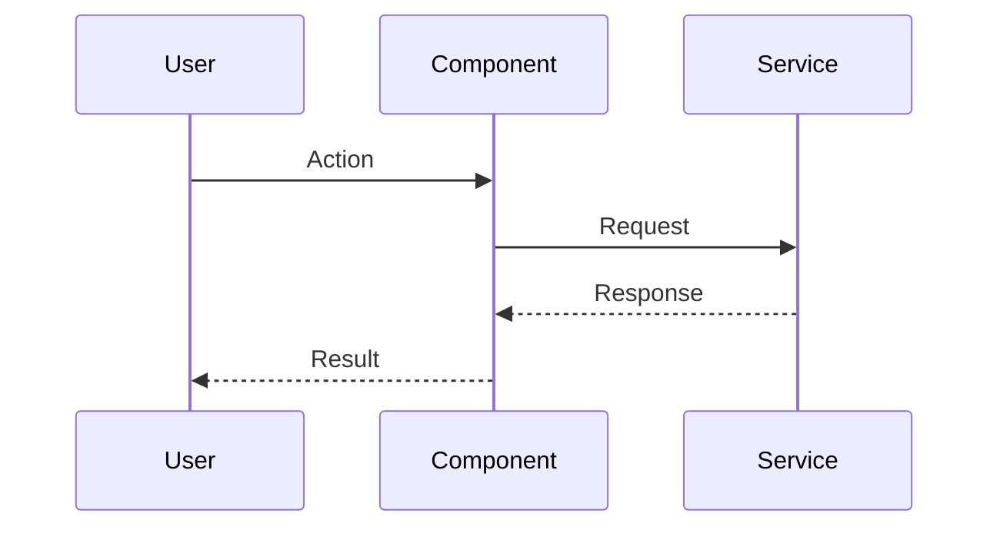
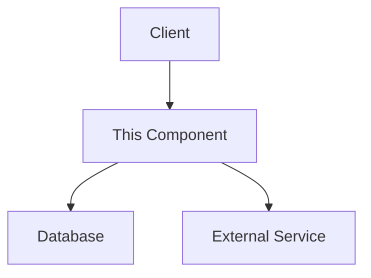

# Documentation for {filename}

## Overview

<!-- REQUIRED: Provide a brief overview of what this file does and its purpose -->

[PLEASE FILL OUT: Overview]

## Dependencies

<!-- List any important dependencies or related components -->

[PLEASE FILL OUT: Dependencies]

## Key Functions/Components

<!-- REQUIRED: Document the main functions, classes, or features -->

[PLEASE FILL OUT: Functions/Components]

## Usage Examples

<!-- Provide examples of how to use this code -->

[PLEASE FILL OUT: Examples]

## Diagrams

<!-- REQUIRED: Include professional-quality diagrams that illustrate the component's structure, behavior, or relationships -->
<!-- Use mermaid.js syntax for diagrams: https://mermaid-js.github.io/ -->
<!-- Include at least one diagram that best represents this component -->

### Sequence Diagram

### Component/Architecture Diagram

### Additional Diagrams

<!-- Add any other diagrams that help explain this component -->
<!-- Class diagrams, state diagrams, etc. as appropriate -->

## Notes

<!-- Any additional information that might be important -->

---

_This documentation is linked to {tracked_files}_
